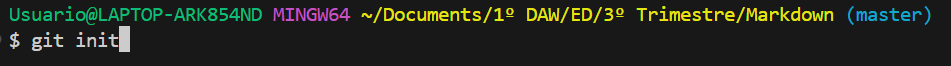

# COMANDOS DE GIT IMPORTANTES QUE NO CONOCIAS

## Configuración inicial
- `git config --global user.name "Tu Nombre"`:

Configura el nombre de usuario para tus commits.
```bash
    git config --global user.name "Alfonso"
```
- `git config --global user.email "tu@email.com"`:

Configura el correo electrónico asociado con tus commits.
```bash
    git config --global user.email "alfonso.ascaso.lizarrondo@gmail.com"
```

## Iniciar un repositorio
- `git init`: Inicia un nuevo repositorio Git en el directorio actual.



## Trabajar con cambios
- `git add <archivo>`: Agrega un archivo al área de preparación para ser incluido en el próximo commit.
```bash
    git add prueba.txt
```
- `git add .`: Agrega todos los archivos modificados y nuevos al área de preparación.
```bash
    git add .
```
- `git commit -am "Mensaje del commit"`: Agrega un archivo al área de preparación y crea un nuevo commit y un mensaje descriptivo.
```bash
    git commit -am "Mi primer Markdown"
```

- `git commit -amend`: Si has escrito mal un commit con este comando puedes modificarlo, tienes que pulsar la tecla <strong>"i"<strong> para poder añadir texto.

- `git status`: Muestra el estado actual del repositorio, incluyendo archivos modificados, agregados y pendientes de commit.
```bash
    git status
```

## Sincronización con un repositorio remoto
- `git remote add origin <url_repositorio_remoto>`: Agrega un nuevo repositorio remoto con el nombre "origin".
- `git push -u origin <nombre_rama>`: Sube los cambios de la rama actual al repositorio remoto.
- `git pull origin <nombre_rama>`: Descarga y fusiona los cambios desde el repositorio remoto a la rama actual.
- `git clone <url_repositorio_remoto>`: Clona un repositorio remoto en tu máquina local.

## Historial y visualización
- `git log`: Muestra el historial de commits.
- `git diff`: Muestra las diferencias entre el área de preparación y el directorio de trabajo.
- `git show <hash_commit>`: Muestra información detallada sobre un commit específico.

## Deshacer cambios
- `git reset <archivo>`: Quita un archivo del área de preparación sin deshacer los cambios locales.
- `git reset --hard`: Restaura el directorio de trabajo al estado del último commit.
- `git revert <hash_commit>`: Crea un nuevo commit que deshace los cambios introducidos por un commit anterior.


