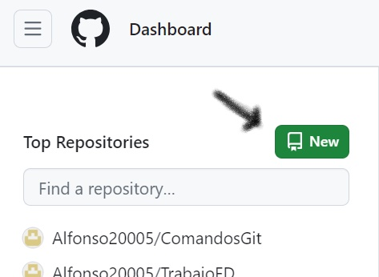

# APRENDE GIT y GITHUB

## ÍNDICE
- [Introduccion Git](#breve-introduccion-sobre-git)
- [Comandos git](#comandos-git)
  * [Configuracion inical](#configuración-inicial)
  * [Iniciar un repositorio](#iniciar-un-repositorio)
  * [Trabajar con cambios](#trabajar-con-cambios)
  * [Sincronización con un repositorio remoto](#sincronización-con-un-repositorio-remoto)
  * [Historial y visualización](#historial-y-visualización)
  * [Deshacer cambios](#deshacer-cambios)
  * [Fusionar una rama a otra](#fusionar-una-rama-a-otra)
  * [Guía para crear y gestionar un proyecto en GitHub](#guía-para-crear-y-gestionar-un-proyecto-en-github)
  * [Dato curioso](#dato-curioso)
  


## Breve introduccion sobre git
Git es un sistema de control de versiones distribuido que permite gestionar el desarrollo de proyectos de software de manera eficiente. Permite rastrear cambios en archivos, colaborar con otros desarrolladores y mantener un historial completo de las modificaciones realizadas en un proyecto.

## Configuración inicial
- `git config --global user.name "Tu Nombre"`:

Configura el nombre de usuario para tus commits.
```bash
    git config --global user.name "Alfonso"
```
- `git config --global user.email "tu@email.com"`:

Configura el correo electrónico asociado con tus commits.
```bash
    git config --global user.email "alfonso.ascaso@gmail.com"
```

## Iniciar un repositorio
- `git init`: Inicia un nuevo repositorio Git en el directorio actual.


## Trabajar con cambios
- `git add <archivo>`: Agrega un archivo al área de preparación para ser incluido en el próximo commit.
```bash
    git add prueba.txt
```
- `git add .`: Agrega todos los archivos modificados y nuevos al área de preparación.
```bash
    git add .
```

> [!NOTE]\
> Puedes utilizar etiquetas anotadas para marcar puntos específicos en la historia de tu repositorio. Estas etiquetas son útiles para marcar versiones de lanzamiento, o cualquier punto que desees resaltar en tu historial.
```bash
    git tag -a <nombre_etiqueta> -m "mensaje descriptivo"
```


- `git commit -am "Mensaje del commit"`: Agrega un archivo al área de preparación y crea un nuevo commit y un mensaje descriptivo.
```bash
    git commit -am "Mi primer Markdown"
```


- `git commit --amend`: Si has escrito mal un commit con este comando puedes modificarlo, tienes que pulsar la tecla <strong>`i`<strong> para poder añadir texto.

- `git status`: Muestra el estado actual del repositorio, incluyendo archivos modificados, agregados y pendientes de commit.
```bash
    git status
```


- `git checkout -b subrama`: Crea una nueva rama llamada "subrama" y cambia a esa rama en tu repositorio de Git.


- `git branch -d subrama`: Elimina la rama llamada "subrama" de tu repositorio local de Git.

> [!IMPORTANT]\
> Este comando eliminará la rama siempre y cuando no haya cambios en esa rama que aún no hayan sido fusionados en otra parte del repositorio. Si hay cambios sin fusionar, Git mostrará un mensaje de advertencia y no eliminará la rama a menos que se especifique el uso del modificador `-D` en lugar de `-d`, lo que forzaría la eliminación.


## Sincronización con un repositorio remoto
- `git remote add origin <url_repositorio_remoto>`: Agrega un nuevo repositorio remoto con el nombre "origin".
- `git push -u origin <nombre_rama>`: Sube los cambios de la rama actual al repositorio remoto.
- `git pull origin <nombre_rama>`: Descarga y fusiona los cambios desde el repositorio remoto a la rama actual.
- `git clone <url_repositorio_remoto>`: Clona un repositorio remoto en tu máquina local.

## Historial y visualización
- `git log`: Muestra el historial de commits.

- `git diff`: Muestra las diferencias entre el área de preparación y el directorio de trabajo.

- `git show <hash_commit>`: Muestra información detallada sobre un commit específico.


## Deshacer cambios
|  Comando                    |Descripcion                                                                  |
|-----------------------------|-------------------------------------------------------------------|
|`git reset <archivo>`        | Quita un archivo del área de preparación sin deshacer los cambios locales.                                                                  |
|`git reset --hard`           | Restaura el directorio de trabajo al estado del último commit, deshaciendo los cambios locales.                                                                  |
|`git revert <hash_commit>`   | Crea un nuevo commit que deshace los cambios introducidos por un commit anterior, revirtiendo esos cambios.                                                                  |

> [!WARNING]\
>El comando `git reset --hard` puede deshacer cambios en el área de trabajo y el índice, lo que significa que puede eliminar permanentemente los cambios no guardados y deshacer los commits, incluso eliminando archivos de seguimiento. Por lo tanto, es importante tener cuidado al usar este comando, ya que puede causar pérdida de trabajo no guardado o cambios importantes en el historial del repositorio.

## Fusionar una rama a otra
- `git merge <archivo que quieres volcar> <archivo en el que lo quieres volcar>`: Se utiliza para combinar los cambios de una rama en otra
``` java
git merge subrama master
```


## Guía para crear y gestionar un proyecto en GitHub

1. **Crea una cuenta en GitHub:** Si aún no tienes una cuenta, ve a [GitHub.com](https://github.com/) y regístrate.
   
2. **Inicia sesión en tu cuenta:** Una vez que tengas una cuenta, inicia sesión en GitHub.
   
3. **Crea un nuevo repositorio:** En tu perfil de GitHub, haz clic en el botón "Nuevo repositorio" o "New repository".

   
4. **Completa la información del repositorio:** Dale un nombre descriptivo a tu repositorio y opcionalmente, una descripción. Puedes elegir si quieres que el repositorio sea público o privado.
   
   
5. **Clona el repositorio en tu ordenador:** Usa el comando `git clone` seguido de la URL de tu repositorio para copiarlo en tu ordenador y trabajar en él localmente.

> [!TIP]\
> Te recomendaria primero crear tu repositorio en github antes y asi podras 
clonar tu repositorio a tu ordenador, porque si empiezas primero a hacerlo por tu cuenta en un editor y luego creas un proyecto en github puede que tengas problemas luego al intentar subirlo


6. **Eliminar tu repositorio de github:** 
    -  En la barra de menú del repositorio, haz clic en `"Settings"` o "Configuración".
     
    -  Vete abajo del todo hasta la zona donde pone `"Danger Zone"` y dale a `"delete this repository"`.
     
    - Te pedirá que confirmes que quieres borrar
     

    > **IMPORTANTE:** Cuando elimines el repositorio te pedira que vuelvas a poner tu contraseña

## Dato curioso
Su mascota oficial es un gato llamado `Octocat`. Esta mascota es una figura icónica asociada con GitHub y se utiliza en varios lugares, como en la página de inicio de GitHub, en camisetas. El `Octocat` combina la palabra `octo`, que significa `ocho` en referencia a los ocho brazos de un pulpo, con `cat`, que es `gato` en inglés, para representar la idea de que GitHub te ayuda a hacer más en menos tiempo, como si tuvieras múltiples brazos.
